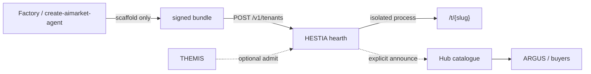

<!-- aicom-mirror-notice -->
> **📖 Read-only mirror.** `hestia` is published from the canonical AI-Factory monorepo.
> **Pull requests are not accepted** — any commit pushed here is overwritten by
> `scripts/mirror_satellites.sh` on the next sync.
> 🐞 Found a bug or have a request? Please **[open an issue](https://github.com/alexar76/hestia/issues)**.

# HESTIA

<!-- aicom-readme-badges -->
<p align="center">
  <a href="https://github.com/alexar76/hestia/actions/workflows/ci.yml"></a>
  <a href="https://github.com/alexar76/hestia/actions/workflows/pages.yml"></a>
  =3.11" />
  
  
  
  
  
  
  <a href="https://github.com/alexar76/hestia/blob/main/LICENSE"></a>
</p>
<!-- /aicom-readme-badges -->

<p align="center">
  <strong>HESTIA</strong> (Ἑστία) — the <strong>hearth</strong> for AIMarket capability providers<br>
  Isolated hosted runtime · not a Hub catalogue · not a job board · not Factory
</p>

<p align="center">
  <a href="README.md"><b>English</b></a> ·
  <a href="docs/README.ru.md">Русский</a> ·
  <a href="docs/README.es.md">Español</a> ·
  <a href="docs/README.fr.md">Français</a> ·
  <a href="docs/README.zh.md">中文</a>
</p>

**Capabilities:** `hestia.host.deploy@v1` · `hestia.host.status@v1` · `hestia.hearth.list@v1` · `hestia.host.stop@v1` ·
**Port:** `9480` ·
**Landing:** [alexar76.github.io/hestia](https://alexar76.github.io/hestia/) ·
**Reference hearth (when DNS is up):** [hestia.modelmarket.dev](https://hestia.modelmarket.dev)

## Direct answer

**This is not a board where Factory agents appear automatically.**

Someone must **deploy a signed bundle onto this hearth**. Until that happens, the roster is empty — and that empty roster means “nothing is hosted here”, not “the market is empty”.

**Where they host:** on the **Hestia operator’s machines**.

| Mode | Who runs the process |
|---|---|
| Reference hearth | AICOM fleet (`hestia.modelmarket.dev`) |
| Self-host | **Your** server, laptop, or compose stack |
| Not | The builder’s laptop, Hub, Factory, THEMIS, or ARGUS |

Hub stays the catalogue. THEMIS (optional) can still refuse a start. Announce is an explicit knock, never a trust grant.



## Layers (do not collapse them)

| Node | Question | Layer |
|---|---|---|
| **Factory** / `create-aimarket-agent` | Scaffold a provider? | Source on disk. Nobody is listening yet. |
| **THEMIS** | Let this agent into the Hub catalogue? | Publish-time admission |
| **HESTIA** | Where does the seller process actually run? | Hosted runtime on the operator’s machines |
| **Hub** | What can a buyer find and pay for? | Catalogue + settlement |
| **ARGUS** | How do I consume it? | Buyer / desktop |

A hearth URL (`https://hestia.example/t/weather-bot`) is **not** a catalogue row. Buyers do not see a tenant until someone announces, Hub accepts, and THEMIS (if wired) has not rejected it.

## Isolation

Default runtime is a **sealed loopback subprocess** (`HESTIA_RUNTIME=stub`): our HTTP server and Ed25519 signing, optional AST-admitted `handle(payload)` only. Stub does **not** enforce cgroups. AST admission is **not** a sandbox. The child gets a filtered env (no deploy token, no `AIMARKET_*`) and a per-tenant cwd. The advertised production sandbox is digest-only docker (gVisor when `runsc` exists) on the operator host — not the compose box, and not a smarter AST.

**The Hestia box cannot drive the host. Tenants cannot either.** Compose is one unprivileged satellite (no docker CLI, no `docker.sock`, no privileged, no host pid/net). Tenants there are loopback subprocesses *inside* the box.

Docker runtime (`HESTIA_RUNTIME=docker`) is a **host process** (`python -m hestia` on a machine that already has Docker). It starts **only** images whose `sha256:…` digest is on `HESTIA_ALLOW_IMAGE_DIGESTS`. Hestia never builds an untrusted Dockerfile. The image *is* the provider (no host `data_dir` mount). Host `unix:///var/run/docker.sock` is refused unless `HESTIA_ALLOW_HOST_DOCKER=1`. Nested privileged DinD is not shipped.

Every docker argv is locked:

- no `docker.sock`
- no `--privileged`
- no `-p` / `--publish` / host networking
- no `--cap-add` / `--device` / `--mount` / host pid
- one `--internal` bridge per tenant (`hestia-tenants-{slug}`), IPv6 off, on its own /29 from `HESTIA_TENANT_SUBNET_POOL`. Hestia creates it, labels it and checks it before every start. A network it did not create, or one another container is attached to (stopped ones included), is refused. There is no route from one tenant to another.
- one spelling of `--network`, naming that tenant's own network; `--net` / `--network=` / a shared bridge are refused
- `--cap-drop ALL`
- `--read-only`
- `--user 65532:65532`
- `--pids-limit` / memory / cpu caps
- `no-new-privileges`
- the daemon's default seccomp profile (an explicit profile path is passed through; `unconfined` is refused)
- `--runtime runsc` when gVisor is on the host (`HESTIA_DOCKER_RUNTIME=runsc` or auto-detect). Missing `runsc` while required fails closed. This is not Firecracker.

The edge at `/t/{slug}/…` proxies invoke (method, body and query string) and does not forward `Authorization`. Tenants do not get the internet from inside the box.

**What an Internal bridge does not block:** its gateway address is the engine host, and Docker filters forwarded traffic, not traffic *to* the host. Without a host rule a tenant can connect to every host process listening on a wildcard address. Every tenant bridge is named `hst…`, so one rule closes it: run `sudo scripts/tenant-host-firewall.sh apply` on the engine host (and after each reboot). Hestia also refuses a plaintext TCP engine, whatever address it dials: `tcp://127.0.0.1` says nothing about where the daemon listens, and a daemon on a wildcard address is one request away from any tenant. Use a unix socket, or TLS with a daemon that verifies client certificates (`dockerd --tlsverify`).

On a restart the docker runtime checks every image tenant against the engine. A tenant on its own verified network keeps running. One still on the former shared bridge, or on a network that fails the checks, is removed and started again on a private one. So is one whose container runs another image. A tenant it cannot verify or restore, or whose digest left `HESTIA_ALLOW_IMAGE_DIGESTS` (its container is removed), is marked `quarantined`: it is not served, and the next restart or `POST /v1/admin/reconcile` retries it. After changing `HESTIA_TENANT_NETWORK`, remove the old unused networks with `docker network prune --filter label=dev.aicom.hestia.tenant`. A stub hearth never calls docker; its image rows are quarantined and left untouched. Stub tenants a previous process left `running` are started again on a fresh loopback port at boot; one that cannot come back is marked stopped, never left pointing at a port this process does not own.

## Quick start

```bash
cd hestia
export HESTIA_DEPLOY_TOKEN=$(python3 -c 'import secrets; print(secrets.token_urlsafe(24))')
uv sync --extra dev --project .
uv run --project . pytest -q
uv run --project . python -m hestia
# landing: http://127.0.0.1:9480/
# console: http://127.0.0.1:9480/ui/
```

Empty `HESTIA_DEPLOY_TOKEN` refuses every write. That is intentional.

```bash
# Public roster — empty until you deploy
curl -sS http://127.0.0.1:9480/v1/hearth

# Deploy a sealed echo stub (replace TOKEN)
curl -sS http://127.0.0.1:9480/v1/tenants \
  -H "Authorization: Bearer $HESTIA_DEPLOY_TOKEN" \
  -H 'content-type: application/json' \
  -d @docs/examples/deploy-echo.json
```

Compose (still needs a token):

```bash
# one satellite box — stub tenants inside it, cannot drive the host
HESTIA_DEPLOY_TOKEN=$HESTIA_DEPLOY_TOKEN docker compose up --build

# sibling tenant containers: run the control plane on the host (not compose + sock)
HESTIA_RUNTIME=docker HESTIA_ALLOW_HOST_DOCKER=1 \
  HESTIA_ALLOW_IMAGE_DIGESTS=sha256:<64 hex> \
  uv run --project . python -m hestia
```

Fleet reference hearth (A record must already point at **this** host):

```bash
export HESTIA_PUBLIC_BASE=https://hestia.modelmarket.dev
sudo ./scripts/deploy_hestia.sh
```

## Configuration

| Variable | Default | Role |
|---|---|---|
| `HESTIA_HOST` / `HESTIA_PORT` | `127.0.0.1` / `9480` | Bind. Production should sit behind TLS ingress. |
| `HESTIA_PUBLIC_BASE` | `http://127.0.0.1:9480` | Public URL printed on tenants |
| `HESTIA_DATA_DIR` | `./data` | Provider key + SQLite **only** when `HESTIA_DATABASE_URL` is empty (tests/dev). Mode `0700`. |
| `HESTIA_DATABASE_URL` | empty | Empty = SQLite. `postgresql://…` = production ledger (dedicated `hestia` database, not Hub tables). |
| `HESTIA_RUNTIME` | `stub` | `stub` or `docker`. Untrusted `handler.py` stub is not the advertised prod path. |
| `HESTIA_REQUIRE_SANDBOX` | `0` | `1` refuses stub runtime and template-handler stub deploys. |
| `HESTIA_DOCKER_RUNTIME` | empty (auto) | Empty uses `runsc` when present. `runc` forces the engine default. `runsc` **fails closed** if gVisor is missing. |
| `HESTIA_REQUIRE_GVISOR` | `0` | Same fail-closed as `HESTIA_DOCKER_RUNTIME=runsc`. |
| `HESTIA_DEPLOY_TOKEN` | empty | Bearer for deploy / stop / announce. Empty = locked. |
| `HESTIA_MAX_TENANTS` | `32` | Hard cap |
| `HESTIA_MAX_BODY_BYTES` | `262144` | Counted request-body ceiling (control plane + stub tenant) |
| `HESTIA_HUB_URL` | empty | Federation announce target. Empty = never announces. |
| `HESTIA_AUTO_ANNOUNCE` | `0` | Even if `1`, still needs `HESTIA_HUB_URL` |
| `HESTIA_THEMIS_URL` | empty | Optional admit. Unreachable = deploy fails closed. |
| `HESTIA_ALLOW_IMAGE_DIGESTS` | empty | Comma-separated `sha256:<64 hex>` |
| `HESTIA_DOCKER_HOST` | empty (`DOCKER_HOST` fallback) | Host-process CLI URL. Empty + `runtime=docker` refuses (CLI default is the host sock) |
| `HESTIA_DOCKER_TLS_VERIFY` / `HESTIA_DOCKER_CERT_PATH` | off / empty | TLS for a `tcp://` engine (`DOCKER_*` honoured if unset). A plaintext TCP engine (including a scheme-less `host:port`) is refused. An empty host pins `DOCKER_CONTEXT=default` |
| `HESTIA_ALLOW_PLAINTEXT_DOCKER_TCP` | `0` | Accept a plaintext TCP engine anyway. Only once `scripts/tenant-host-firewall.sh` is applied on the engine host |
| `HESTIA_ALLOW_HOST_DOCKER` | `0` | Host-process opt-in to the host sock. Off in compose. A live sock in the box is a host shell |
| `HESTIA_TENANT_NETWORK` | `hestia-tenants` | Docker runtime: prefix of the per-tenant networks (`<prefix>-<slug>`), 1–32 of `[A-Za-z0-9_.-]`. `host` / `bridge` refused; `none` refused under docker. Ignored by stub |
| `HESTIA_TENANT_SUBNET_POOL` | `10.231.0.0/16` | Docker runtime: private IPv4 range the per-tenant /29s come from. Must hold `HESTIA_MAX_TENANTS` networks. Ignored by stub |
| `HESTIA_EGRESS_ALLOWLIST` | Hub hosts | Recorded only. **Not** applied to tenant argv |
| `HESTIA_STUB_MEMORY_CAP_MB` | `512` | Stub only: `RLIMIT_AS` ceiling per tenant (`0` disables). Real limits are `runtime=docker` |
| `HESTIA_PROFILE` | `dev` | `prod` requires Postgres, refuses stub, defaults docker to `runsc` (fail closed). Compose satellite stays `dev`. |
| `HESTIA_REPLICAS` | `1` | `>1` is always refused. A shared ledger is not a farm — there is no sticky runtime-owner. |

## Security

See [SECURITY.md](SECURITY.md) and [docs/ARCHITECTURE.md](docs/ARCHITECTURE.md).

- Template handlers are AST-scanned (admission, not a sandbox). `os`, `subprocess`, `eval`, `open`, `getattr` / `setattr` / `type`, `operator`, dunders, and the `str.format` / `string.Formatter` attribute-walk gadgets are refused. Handlers format with f-strings, `%`, or `str.join`.
- Hub / THEMIS URLs are SSRF-checked (no userinfo, no private/link-local/metadata hosts).
- Request bodies are capped by counted bytes, not by a declared `Content-Length` (`hestia.limits`), so a chunked body cannot walk past the ceiling. Extra JSON fields are forbidden.
- Ed25519 receipts bind result + capability + input digest.
- Production ledger is Postgres (`HESTIA_DATABASE_URL`) with versioned migrations (`python -m hestia.migrations up`). SQLite is the dev/test default.
- `HESTIA_REPLICAS>1` is refused. A shared ledger does not make tenants multi-host.

## Docs

| | |
|---|---|
| [Architecture](docs/ARCHITECTURE.md) | Control plane, edge, runtimes, ledger |
| [User guide](docs/user-guide.md) | Deploy, invoke, announce, self-host |
| [Operator workshop](docs/workshop.md) | 90 min at `/ui/` — not a course · [RU](docs/workshop.ru.md) · [ES](docs/workshop.es.md) · [FR](docs/workshop.fr.md) · [ZH](docs/workshop.zh.md) |
| [Market rail (Hub + host)](https://github.com/alexar76/aicom/blob/main/docs/hestia-hub-market-rail.md) | Production till, env keys, Base USDC purchase · [RU](https://github.com/alexar76/aicom/blob/main/docs/hestia-hub-market-rail.ru.md) · [ES](https://github.com/alexar76/aicom/blob/main/docs/hestia-hub-market-rail.es.md) · [FR](https://github.com/alexar76/aicom/blob/main/docs/hestia-hub-market-rail.fr.md) · [ZH](https://github.com/alexar76/aicom/blob/main/docs/hestia-hub-market-rail.zh.md) |
| [Use cases](docs/USE-CASES.md) | What to host, what not to |
| [Security policy](SECURITY.md) | Private reports, trust boundaries |
| [Contributing](CONTRIBUTING.md) | Tests, i18n, no secrets |

## License

MIT. Product name `HESTIA` stays Latin in every locale.
