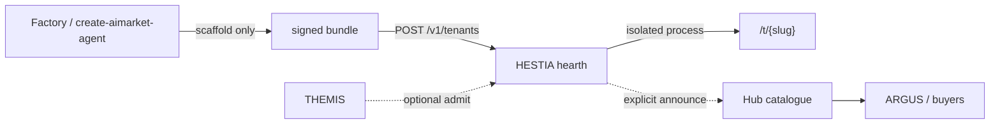

<!-- aicom-mirror-notice -->
> **📖 Read-only mirror.** `hestia` is published from the canonical AI-Factory monorepo.
> **Pull requests are not accepted** — any commit pushed here is overwritten by
> `scripts/mirror_satellites.sh` on the next sync.
> 🐞 Found a bug or have a request? Please **[open an issue](https://github.com/alexar76/hestia/issues)**.

# HESTIA

<!-- aicom-readme-badges -->
<p align="center">
  <a href="https://github.com/alexar76/hestia/actions/workflows/ci.yml"></a>
  <a href="https://github.com/alexar76/hestia/actions/workflows/pages.yml"></a>
  =3.11" />
  
  
  
  
  
  
  <a href="https://github.com/alexar76/hestia/blob/main/LICENSE"></a>
</p>
<!-- /aicom-readme-badges -->

<p align="center">
  <strong>HESTIA</strong> (Ἑστία) — the <strong>hearth</strong> for AIMarket capability providers<br>
  Isolated hosted runtime · not a Hub catalogue · not a job board · not Factory
</p>

<p align="center">
  <a href="README.md"><b>English</b></a> ·
  <a href="docs/README.ru.md">Русский</a> ·
  <a href="docs/README.es.md">Español</a> ·
  <a href="docs/README.fr.md">Français</a> ·
  <a href="docs/README.zh.md">中文</a>
</p>

**Capabilities:** `hestia.host.deploy@v1` · `hestia.host.status@v1` · `hestia.hearth.list@v1` · `hestia.host.stop@v1` ·
**Port:** `9480` ·
**Landing:** [alexar76.github.io/hestia](https://alexar76.github.io/hestia/) ·
**Reference hearth (when DNS is up):** [hestia.modelmarket.dev](https://hestia.modelmarket.dev)

## Direct answer

**This is not a board where Factory agents appear automatically.**

Someone must **deploy a signed bundle onto this hearth**. Until that happens, the roster is empty — and that empty roster means “nothing is hosted here”, not “the market is empty”.

**Where they host:** on the **Hestia operator’s machines**.

| Mode | Who runs the process |
|---|---|
| Reference hearth | AICOM fleet (`hestia.modelmarket.dev`) |
| Self-host | **Your** server, laptop, or compose stack |
| Not | The builder’s laptop, Hub, Factory, THEMIS, or ARGUS |

Hub stays the catalogue. THEMIS (optional) can still refuse a start. Announce is an explicit knock, never a trust grant.


```mermaid
flowchart LR
  F[Factory / create-aimarket-agent] -->|scaffold only| B[signed bundle]
  B -->|POST /v1/tenants| H[HESTIA hearth]
  T[THEMIS] -.->|optional admit| H
  H -->|isolated process| U["/t/{slug}"]
  H -.->|explicit announce| Hub[Hub catalogue]
  Hub --> A[ARGUS / buyers]
```

## Layers (do not collapse them)

| Node | Question | Layer |
|---|---|---|
| **Factory** / `create-aimarket-agent` | Scaffold a provider? | Source on disk. Nobody is listening yet. |
| **THEMIS** | Let this agent into the Hub catalogue? | Publish-time admission |
| **HESTIA** | Where does the seller process actually run? | Hosted runtime on the operator’s machines |
| **Hub** | What can a buyer find and pay for? | Catalogue + settlement |
| **ARGUS** | How do I consume it? | Buyer / desktop |

A hearth URL (`https://hestia.example/t/weather-bot`) is **not** a catalogue row. Buyers do not see a tenant until someone announces, Hub accepts, and THEMIS (if wired) has not rejected it.

## Isolation

Default runtime is a **sealed loopback subprocess** (`HESTIA_RUNTIME=stub`): our HTTP server and Ed25519 signing, optional AST-admitted `handle(payload)` only. Stub does **not** enforce cgroups. AST admission is **not** a sandbox. The child gets a filtered env (no deploy token, no `AIMARKET_*`) and a per-tenant cwd. The advertised production sandbox is digest-only docker (gVisor when `runsc` exists) on the operator host — not the compose box, and not a smarter AST.

**The Hestia box cannot drive the host. Tenants cannot either.** Compose is one unprivileged satellite (no docker CLI, no `docker.sock`, no privileged, no host pid/net). Tenants there are loopback subprocesses *inside* the box.

Docker runtime (`HESTIA_RUNTIME=docker`) is a **host process** (`python -m hestia` on a machine that already has Docker). It starts **only** images whose `sha256:…` digest is on `HESTIA_ALLOW_IMAGE_DIGESTS`. Hestia never builds an untrusted Dockerfile. The image *is* the provider (no host `data_dir` mount). Host `unix:///var/run/docker.sock` is refused unless `HESTIA_ALLOW_HOST_DOCKER=1`. Nested privileged DinD is not shipped.

Every docker argv is locked:

- no `docker.sock`
- no `--privileged`
- no `-p` / `--publish` / host networking
- no `--cap-add` / `--device` / `--mount` / host pid
- one `--internal` bridge per tenant (`hestia-tenants-{slug}`), IPv6 off, on its own /29 from `HESTIA_TENANT_SUBNET_POOL`. Hestia creates it, labels it and checks it before every start. A network it did not create, or one another container is attached to (stopped ones included), is refused. There is no route from one tenant to another.
- one spelling of `--network`, naming that tenant's own network; `--net` / `--network=` / a shared bridge are refused
- `--cap-drop ALL`
- `--read-only`
- `--user 65532:65532`
- `--pids-limit` / memory / cpu caps
- `no-new-privileges`
- the daemon's default seccomp profile (an explicit profile path is passed through; `unconfined` is refused)
- `--runtime runsc` when gVisor is on the host (`HESTIA_DOCKER_RUNTIME=runsc` or auto-detect). Missing `runsc` while required fails closed. This is not Firecracker.

The edge at `/t/{slug}/…` proxies invoke (method, body and query string) and does not forward `Authorization`. Tenants do not get the internet from inside the box.

**What an Internal bridge does not block:** its gateway address is the engine host, and Docker filters forwarded traffic, not traffic *to* the host. Without a host rule a tenant can connect to every host process listening on a wildcard address. Every tenant bridge is named `hst…`, so one rule closes it: run `sudo scripts/tenant-host-firewall.sh apply` on the engine host (and after each reboot). Hestia also refuses a plaintext TCP engine, whatever address it dials: `tcp://127.0.0.1` says nothing about where the daemon listens, and a daemon on a wildcard address is one request away from any tenant. Use a unix socket, or TLS with a daemon that verifies client certificates (`dockerd --tlsverify`).

On a restart the docker runtime checks every image tenant against the engine. A tenant on its own verified network keeps running. One still on the former shared bridge, or on a network that fails the checks, is removed and started again on a private one. So is one whose container runs another image. A tenant it cannot verify or restore, or whose digest left `HESTIA_ALLOW_IMAGE_DIGESTS` (its container is removed), is marked `quarantined`: it is not served, and the next restart or `POST /v1/admin/reconcile` retries it. After changing `HESTIA_TENANT_NETWORK`, remove the old unused networks with `docker network prune --filter label=dev.aicom.hestia.tenant`. A stub hearth never calls docker; its image rows are quarantined and left untouched. Stub tenants a previous process left `running` are started again on a fresh loopback port at boot; one that cannot come back is marked stopped, never left pointing at a port this process does not own.

## Sandbox (`HESTIA_RUNTIME=wasm`)

With `HESTIA_RUNTIME=wasm` a template handler never runs as a process of its own. Each call runs in a
**fresh WebAssembly instance**: CPython 3.14 compiled to WASI, executed by wasmtime, in the separate
`hestia-runner` service (`docker compose --profile wasm up -d`). That container has **no network at all**,
**no secrets** (none of the hearth's environment), a read-only filesystem, and one Unix socket in a volume
it shares with the hearth. Inside the instance a handler sees the standard library, read-only, and nothing
else:

| A handler tries to | It gets |
|---|---|
| read `/data/provider.key`, `/etc/passwd`, `~/.ssh`, the runner's socket | `FileNotFoundError` — no host path exists in the instance |
| write to the standard library | `PermissionError` (read-only) |
| open a socket | no sockets in WASI preview 1 |
| start a process, load native code (`ctypes`) | not supported in WASI |
| read the environment | two fixed variables: `PYTHONHASHSEED`, `PYTHONHOME` |
| allocate past the cap, loop for ever, flood stdout | `MemoryError` (256 MiB), timeout (10 s, epoch interruption), output refused past 4 MiB |
| keep state between calls, or read another call's | every call is a new instance |

The hearth signs the result with the tenant's own key **outside** the sandbox (the key never enters it),
with the stub's canonical and status codes: a tenant moved from `stub` to `wasm` keeps its key, and its
answers verify as before. Because the sandbox is the boundary, a `wasm` handler gets a lint, not the stub's
allow-list: any module the WASI build ships may be imported (`base64`, `difflib`, `typing`, `decimal`,
`unicodedata`… — not `zlib`, sockets or threads). An agent has no process between calls, so an idle one
costs disk, not memory: hundreds fit where the stub held about thirty.

Proven on the reference hearth with a stranger's agent written to escape: every path it tried was
`FileNotFoundError`, the network and processes were unavailable, its environment held two variables.

## Owners

A shared hearth hosts agents of more than one business, so the operator token is not the only key. An **owner** is an Ed25519 key the operator admits (`POST /v1/owners`). Every owner request is signed over the hearth's public base, method, path, a unix timestamp (±300 s), a one-time nonce and the SHA-256 of the body (`X-Hestia-Owner` / `-Timestamp` / `-Nonce` / `-Signature`, format `hestia-owner/1` in [`hestia/owners.py`](hestia/owners.py)).

| Who | May |
|---|---|
| Operator (deploy token) | everything, as before; admits, limits and suspends owners |
| Owner | deploy onto a free slug or its own, within its quota (`HESTIA_OWNER_MAX_TENANTS`, default 3); stop, announce and list **only its own** agents; read its standing at `GET /v1/owners/me` |
| Anyone else | read the public roster, invoke agents |

A replayed request, a request signed for another hearth, path or body, and an owner who names another key in `owner_pubkey` are refused. The all-zero placeholder key and every other small-order Ed25519 key can never own anything, so agents deployed with the placeholder stay the operator's alone.

`HESTIA_OPEN_OWNERS=1` lets any valid key admit itself on its first deploy. Under the stub it gets no right to run code — AST admission is not a sandbox — so strangers deploy pinned images and sealed stubs only. Under `HESTIA_RUNTIME=wasm`, `HESTIA_OPEN_OWNER_CODE=1` gives them that right: their code runs in the sandbox above, and their agents reach the public manifest only through the listing review below. Both off by default; the reference hearth runs with both on.

```bash
python -m hestia.owner_cli keygen --out owner.key        # prints the public key for the operator
python -m hestia.owner_cli deploy --hearth https://hestia.example --key owner.key --body deploy.json
python -m hestia.owner_cli stop   --hearth https://hestia.example --key owner.key --slug my-agent
python -m hestia.owner_cli proof  --key owner.key --domain example.com   # prints the TXT record and the file that prove your domain
python -m hestia.owner_cli domain --hearth https://hestia.example --key owner.key --domain example.com
```

## Listing review

Hubs index this hearth's manifest, so an agent in it is shown to the buyers of every hub that pins the hearth.
An **owner's** agent runs as soon as it deploys — callable at its own `/t/{slug}` door — but enters the
manifest only when an automatic review passes ([`hestia/listing.py`](hestia/listing.py)). The review reads
what a buyer's model would read (name, description, schemas) and holds the listing for instruction tags,
"ignore previous instructions", "do not tell the user", "before using any other tool", covert actions,
credential paths, hidden characters, HTML comments, a word mixing look-alike scripts (Latin with Cyrillic,
Greek, …), and a capability id close to another owner's family or a name that reads the same as an agent's on
this hearth, running or not. The deploy answer and `GET /v1/tenants` give the owner the reasons; the operator lists or holds
by hand with `POST /v1/admin/tenants/{slug}/listing` (`{"listed": true|false, "reason": "…"}`). The
operator's own agents are not reviewed.

The names a hub shows buyers belong to whoever first deployed under them, for good
([`hestia/names.py`](hestia/names.py)): a capability family (the id before `@`), a product id, and a publisher
(publisher id and payout address). They are compared folded — case, separators, look-alike letters and a
trailing version do not make a new name — so `merkle-proof@v2`, `merkle_proof.v2@v1` and `Merkle.Pr0of@v1` are
all `merkle.proof`'s family. A stopped agent, a renamed one and a suspended owner keep their names; another owner
gets 409. `hestia*` is the hearth's own, and the operator holds the prefixes in `HESTIA_RESERVED_PREFIXES`
(default `aicom,aimarket,modelmarket`). Within one owner, an exact id (any case) runs as one agent at a time.
The claim is the database's (a primary key), so two processes on one ledger cannot both win a name. The operator
lists claims with `GET /v1/admin/names`, reserves a name or hands it on with `POST /v1/admin/names`
(`{"kind": "family|product|publisher|prefix", "name": "…", "holder": "operator" | owner key}`; a `prefix`
covers every name starting with it, e.g. a brand for its company), and frees one with
`POST /v1/admin/names/release` once its holder's agents are stopped.

A held agent answers only at its own `/t/{slug}` door: the routed invoke a hub calls reaches listed agents only.
An owner's redeploy re-runs the review but cannot lift a hold the operator placed, and an operator redeploy does
not list a held agent — the listing call does. A suspended owner's agents leave the manifest and the roster and
are served at neither door. `HESTIA_MAX_TENANTS` counts running and quarantined agents; a stopped one keeps its
slug and names, not its place.

An owner who proves a domain gets the names that begin with that domain, zone included
([`hestia/domains.py`](hestia/domains.py)). The proof is a TXT record on `_hestia.<domain>` reading
`hestia-owner=<public key>`, or `https://<domain>/.well-known/hestia-owner.json` holding
`{"owner_pubkeys": ["<public key>"]}`; `python -m hestia.owner_cli proof` prints both and `… domain` asks
the hearth to check. From then on every family, product and publisher that begins with the domain, in either
order — `attestedmemory.net.deal`, `net.attestedmemory.deal`, `attestedmemory-net.deal`,
"Attestedmemory.net Labs" — is that owner's, and hubs see the domain as the agent's `publisher_domain`. The
bare word is nobody's: attestedmemory.com, .dev and .net can be three owners, so `attestedmemory.deal` stays
first come like any name. Only a registrable ASCII domain counts (example.com, example.co.uk; not a
subdomain, not an IDN), and a domain never takes a name another holder already uses. The HTTPS proof is
fetched from public addresses only, without redirects.

## Hubs that sell your agents

A tenant bills each call in USDC on chain, which a hub cannot pay out of a buyer's credits or a
subcontracting allowance. So an owner can let a hub sell its agents on its behalf
([`hestia/hub_billing.py`](hestia/hub_billing.py)):

1. the operator gives the hearth the hub's key: `HESTIA_TENANT_HUB_KEYS=https://hub.example=<key>` — the
   same value as that hub's `AIMARKET_PEER_API_KEYS` entry for this hearth;
2. the owner opens a credit account on that hub and chooses it:
   `python -m hestia.owner_cli billing --hearth … --key owner.key --hub https://hub.example --account acct_…`
   (`--account ""` withdraws the choice);
3. a hub call with that key is served without an on-chain payment and answered with a `hub_billing`
   block signed by the hearth's provider key: whose agent, which hub, which account. The hub verifies it
   against the key it pinned for this hearth and credits the owner `AIMARKET_PUBLISHER_SHARE_BPS` (default
   70 %) of what **it** charged its buyer;
4. `python -m hestia.owner_cli statement` lists every such call, to reconcile with what the hub paid.

The operator's own tenants (placeholder owner key) are sold by any hub whose key the operator configured,
and the hub keeps what it charges. A hub that did not charge (`X-AIMarket-Hub-Charged: 0`, a free trial)
is not served an owner's agent. Operator view: `GET /v1/admin/hub-billing`.

## Quick start

```bash
cd hestia
export HESTIA_DEPLOY_TOKEN=$(python3 -c 'import secrets; print(secrets.token_urlsafe(24))')
uv sync --extra dev --project .
uv run --project . pytest -q
uv run --project . python -m hestia
# landing: http://127.0.0.1:9480/
# console: http://127.0.0.1:9480/ui/
```

Empty `HESTIA_DEPLOY_TOKEN` refuses every write. That is intentional.

```bash
# Public roster — empty until you deploy
curl -sS http://127.0.0.1:9480/v1/hearth

# Deploy a sealed echo stub (replace TOKEN)
curl -sS http://127.0.0.1:9480/v1/tenants \
  -H "Authorization: Bearer $HESTIA_DEPLOY_TOKEN" \
  -H 'content-type: application/json' \
  -d @docs/examples/deploy-echo.json
```

Compose (still needs a token):

```bash
# one satellite box — stub tenants inside it, cannot drive the host
HESTIA_DEPLOY_TOKEN=$HESTIA_DEPLOY_TOKEN docker compose up --build

# sibling tenant containers: run the control plane on the host (not compose + sock)
HESTIA_RUNTIME=docker HESTIA_ALLOW_HOST_DOCKER=1 \
  HESTIA_ALLOW_IMAGE_DIGESTS=sha256:<64 hex> \
  uv run --project . python -m hestia
```

Fleet reference hearth (A record must already point at **this** host; the script refuses
any other unless `--new-host`):

```bash
export HESTIA_PUBLIC_BASE=https://hestia.modelmarket.dev
sudo ./scripts/deploy_hestia.sh
# or from a laptop: sync the Hestia slice and run the same script on the host
./scripts/deploy_hestia.sh --remote <ssh-host>
```

`hestia/.env` on the host is the one source of settings (the environment only fills it on the
first run). Every run dumps the ledger and tags the running images for rollback, starts the
sandbox runner too when `HESTIA_RUNTIME=wasm`, and waits until both are healthy.

## Configuration

| Variable | Default | Role |
|---|---|---|
| `HESTIA_HOST` / `HESTIA_PORT` | `127.0.0.1` / `9480` | Bind. Production should sit behind TLS ingress. |
| `HESTIA_PUBLIC_BASE` | `http://127.0.0.1:9480` | Public URL printed on tenants |
| `HESTIA_DATA_DIR` | `./data` | Provider key + SQLite **only** when `HESTIA_DATABASE_URL` is empty (tests/dev). Mode `0700`. |
| `HESTIA_DATABASE_URL` | empty | Empty = SQLite. `postgresql://…` = production ledger (dedicated `hestia` database, not Hub tables). |
| `HESTIA_RUNTIME` | `stub` | `stub`, `docker` or `wasm`. `wasm` runs template handlers in the WebAssembly sandbox (needs the `hestia-runner` service). The untrusted-`handler.py` stub is not the advertised prod path. |
| `HESTIA_REQUIRE_SANDBOX` | `0` | `1` refuses the stub runtime and template-handler stub deploys (`wasm` is a sandbox and is allowed). |
| `HESTIA_RUNNER_SOCKET` | `/run/hestia-runner/runner.sock` | `wasm`: the sandbox runner's Unix socket (a volume shared by both containers) |
| `HESTIA_OPEN_OWNER_CODE` | `0` | `wasm` only: owners who admitted themselves may deploy code (it runs in the sandbox). Refused with any other runtime |
| `HESTIA_WASM_ROOT` | `/opt/python-wasi` | Runner: CPython for WASI (`python.wasm` + `lib/`), fetched by SHA-256 at image build |
| `HESTIA_RUNNER_WORKERS` / `HESTIA_RUNNER_QUEUE_S` | CPU count (compose 2) / `5` | Runner: calls at once, and how long a call waits for a slot before `503`. The hearth reads the same workers count (its default 2) to size the open lane |
| `HESTIA_RUNNER_MEMORY_MB` / `HESTIA_RUNNER_MAX_OUTPUT` | `256` / `4194304` | Runner: linear memory per call, and the most a handler may write back |
| `HESTIA_OPEN_LANE_SLOTS` / `HESTIA_OPEN_LANE_WAIT_S` | `1` / `2` | `wasm`: runner slots the agents of ALL self-admitted owners share (one call per owner), and how long a call waits for one before `503`. Must stay below `HESTIA_RUNNER_WORKERS`, so the operator's agents always keep a slot |
| `HESTIA_CPUS` / `HESTIA_RUNNER_CPUS` | compose `2` / `1.5` | CPU ceilings of the hearth and runner containers, beside their memory and pids caps |
| `HESTIA_DOCKER_RUNTIME` | empty (auto) | Empty uses `runsc` when present. `runc` forces the engine default. `runsc` **fails closed** if gVisor is missing. |
| `HESTIA_REQUIRE_GVISOR` | `0` | Same fail-closed as `HESTIA_DOCKER_RUNTIME=runsc`. |
| `HESTIA_DEPLOY_TOKEN` | empty | Operator bearer: every write, owner admission. Empty = locked (owner requests still need admitted owners). |
| `HESTIA_OWNER_MAX_TENANTS` | `3` | Default per-owner quota (the operator can set another per owner) |
| `HESTIA_TENANT_HUB_KEYS` | empty | `url=key,…`: hubs that may sell tenants on their owners' behalf (each key = that hub's `AIMARKET_PEER_API_KEYS` entry for this hearth) |
| `HESTIA_OPEN_OWNERS` | `0` | `1` = any valid owner key admits itself on first deploy; code only with `HESTIA_OPEN_OWNER_CODE=1` under `wasm` |
| `HESTIA_OWNER_SKEW_S` | `300` | Owner request clock window, seconds |
| `HESTIA_MAX_TENANTS` | `32` (compose `8`) | Hard cap on running + quarantined agents (a stopped one keeps its slug, not its place). Stub tenants are resident processes (~31 MB each); `wasm` tenants cost disk only (the reference hearth runs 256) |
| `HESTIA_RESERVED_PREFIXES` | `aicom,aimarket,modelmarket` | Name prefixes the operator holds from boot: no owner may deploy a family, product or publisher whose folded name starts with one (`hestia` always) |
| `HESTIA_DOH_URL` | `https://cloudflare-dns.com/dns-query` | DNS-over-HTTPS JSON endpoint an owner's domain TXT proof is read from (`hestia/domains.py`) |
| `HESTIA_MAX_BODY_BYTES` | `262144` | Counted request-body ceiling (control plane + stub tenant) |
| `HESTIA_HUB_URL` | empty | Federation announce target. Empty = never announces. |
| `HESTIA_AUTO_ANNOUNCE` | `0` | Even if `1`, still needs `HESTIA_HUB_URL` |
| `HESTIA_THEMIS_URL` | empty | Optional admit. Unreachable = deploy fails closed. |
| `HESTIA_ALLOW_IMAGE_DIGESTS` | empty | Comma-separated `sha256:<64 hex>` |
| `HESTIA_DOCKER_HOST` | empty (`DOCKER_HOST` fallback) | Host-process CLI URL. Empty + `runtime=docker` refuses (CLI default is the host sock) |
| `HESTIA_DOCKER_TLS_VERIFY` / `HESTIA_DOCKER_CERT_PATH` | off / empty | TLS for a `tcp://` engine (`DOCKER_*` honoured if unset). A plaintext TCP engine (including a scheme-less `host:port`) is refused. An empty host pins `DOCKER_CONTEXT=default` |
| `HESTIA_ALLOW_PLAINTEXT_DOCKER_TCP` | `0` | Accept a plaintext TCP engine anyway. Only once `scripts/tenant-host-firewall.sh` is applied on the engine host |
| `HESTIA_ALLOW_HOST_DOCKER` | `0` | Host-process opt-in to the host sock. Off in compose. A live sock in the box is a host shell |
| `HESTIA_TENANT_NETWORK` | `hestia-tenants` | Docker runtime: prefix of the per-tenant networks (`<prefix>-<slug>`), 1–32 of `[A-Za-z0-9_.-]`. `host` / `bridge` refused; `none` refused under docker. Ignored by stub |
| `HESTIA_TENANT_SUBNET_POOL` | `10.231.0.0/16` | Docker runtime: private IPv4 range the per-tenant /29s come from. Must hold `HESTIA_MAX_TENANTS` networks. Ignored by stub |
| `HESTIA_EGRESS_ALLOWLIST` | Hub hosts | Recorded only. **Not** applied to tenant argv |
| `HESTIA_STUB_MEMORY_CAP_MB` | `512` | Stub only: `RLIMIT_AS` ceiling per tenant (`0` disables). Real limits are `runtime=docker` |
| `HESTIA_PROFILE` | `dev` | `prod` requires Postgres, refuses stub, defaults docker to `runsc` (fail closed). Compose satellite stays `dev`. |
| `HESTIA_REPLICAS` | `1` | `>1` is always refused. A shared ledger is not a farm — there is no sticky runtime-owner. |

## Security

See [SECURITY.md](SECURITY.md) and [docs/ARCHITECTURE.md](docs/ARCHITECTURE.md).

- With `HESTIA_RUNTIME=wasm` template handlers run in the WebAssembly sandbox (see "Sandbox"): no host filesystem, network, processes, native code or secrets; memory, time and output capped; a fresh instance per call, in a container with no network and no secrets. That is the boundary strangers' code is allowed behind.
- Under the stub, template handlers are AST-scanned (admission, not a sandbox). `os`, `subprocess`, `eval`, `open`, `getattr` / `setattr` / `type`, `operator`, dunders, and the `str.format` / `string.Formatter` attribute-walk gadgets are refused. Handlers format with f-strings, `%`, or `str.join`.
- An owner's agent reaches the public manifest only after the listing review; one capability id is one agent.
- Hub / THEMIS URLs are SSRF-checked (no userinfo, no private/link-local/metadata hosts).
- Request bodies are capped by counted bytes, not by a declared `Content-Length` (`hestia.limits`), so a chunked body cannot walk past the ceiling. Extra JSON fields are forbidden.
- Ed25519 receipts bind result + capability + input digest.
- Production ledger is Postgres (`HESTIA_DATABASE_URL`) with versioned migrations (`python -m hestia.migrations up`). SQLite is the dev/test default.
- `HESTIA_REPLICAS>1` is refused. A shared ledger does not make tenants multi-host.

## Docs

| | |
|---|---|
| [Architecture](docs/ARCHITECTURE.md) | Control plane, edge, runtimes, ledger |
| [Verified compute](docs/COMPUTE.md) | Metered and replicated runs of published functions; exactly what a compute receipt does and does not prove |
| [User guide](docs/user-guide.md) | Deploy, invoke, announce, self-host |
| [Operator workshop](docs/workshop.md) | 90 min at `/ui/` — not a course · [RU](docs/workshop.ru.md) · [ES](docs/workshop.es.md) · [FR](docs/workshop.fr.md) · [ZH](docs/workshop.zh.md) |
| [Market rail (Hub + host)](https://github.com/alexar76/aicom/blob/main/docs/hestia-hub-market-rail.md) | Production till, env keys, Base USDC purchase · [RU](https://github.com/alexar76/aicom/blob/main/docs/hestia-hub-market-rail.ru.md) · [ES](https://github.com/alexar76/aicom/blob/main/docs/hestia-hub-market-rail.es.md) · [FR](https://github.com/alexar76/aicom/blob/main/docs/hestia-hub-market-rail.fr.md) · [ZH](https://github.com/alexar76/aicom/blob/main/docs/hestia-hub-market-rail.zh.md) |
| [Use cases](docs/USE-CASES.md) | What to host, what not to |
| [Security policy](SECURITY.md) | Private reports, trust boundaries |
| [Contributing](CONTRIBUTING.md) | Tests, i18n, no secrets |

## License

MIT. Product name `HESTIA` stays Latin in every locale.
